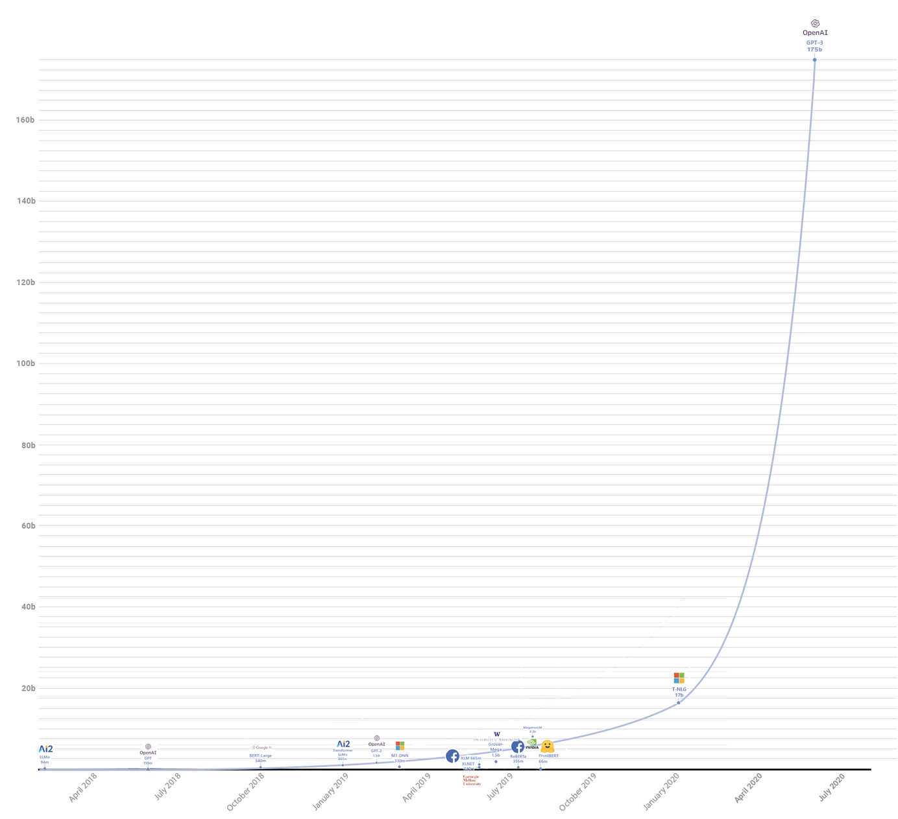

# Transformers

## Related Papers

### Basic Transformer Models
* [Transformer](https://arxiv.org/abs/1706.03762)
* [Transformer-XL](https://arxiv.org/abs/1901.02860)

### Encoder-Only
* [BERT](https://arxiv.org/abs/1810.04805)
* [XLNet](https://arxiv.org/abs/1906.08237)

### Decoder-Only
GPT / GPT-1 is using the same objective as [ELMo](https://arxiv.org/abs/1802.05365) in pre-training phase. (language model, LM; single directed)
* [GPT-1](https://s3-us-west-2.amazonaws.com/openai-assets/research-covers/language-unsupervised/language_understanding_paper.pdf)
* [GPT-2](https://d4mucfpksywv.cloudfront.net/better-language-models/language_models_are_unsupervised_multitask_learners.pdf)
* [GPT-3](https://arxiv.org/abs/2005.14165)

### Encoder-Decoder Models
* [BART](https://arxiv.org/abs/1910.13461)
* [T5](https://arxiv.org/pdf/1910.10683.pdf)

## Compare Their Costs

| Model Name | # Parameters | Memory Cost (≥) | Training Set  | Pre-training ($) |
|------------|--------------|-----------------|---------------|------------------|
| GPT        | 110 million  |                 | 5.75 gigabyte |                  |
| GPT-2      | 1.54 billion | 24 gigabyte     | 40 gigabyte   | 50 thousand      |
| GPT-3      | 175 billion  | 350 gigabyte    | 700 gigabyte  | 12 million       |
| BERT-large | 340 million  | 16 gigabyte     |               | 7 thousand       |
| BART-large | 406 million  | 12 gigabyte     |               |                  |

References:
* [A list of pretrained models in library](https://huggingface.co/transformers/pretrained_models.html)
* [BookCorpus](https://huggingface.co/datasets/bookcorpus)
* [An intro blog to GPT-3](https://samcash.substack.com/p/-laymans-guide-to-language-models)
* [BERT memory analysis](https://krishansubudhi.github.io/deeplearning/2019/09/20/BertMemoryAnalysis.html)
* [GPT-3 training cost](https://towardsdatascience.com/the-future-of-ai-is-decentralized-848d4931a29a#:~:text=Training%20GPT%2D3%20reportedly%20cost,way%20to%20train%20a%20model%3F&text=Artificial%20intelligence%20is%20a%20commodity,Google%2C%20Baidu%2C%20and%20Facebook%C2%B2.)
* [BERT training cost](https://dl.acm.org/doi/fullHtml/10.1145/3381831#:~:text=BERT%2Dlarge%20was%20trained%20on,an%20estimated%20cost%20of%20%2425%2C000.)
* [BART training discussion](https://github.com/pytorch/fairseq/issues/2731)
* [BERT pretraining dataset](https://d2l.ai/chapter_natural-language-processing-pretraining/bert-dataset.html)

